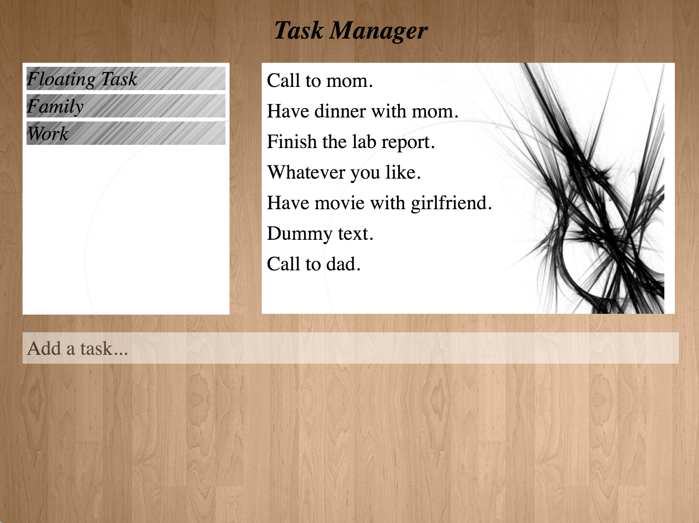

# Task Manager

 

* This is a desktop Task Manager application. It has a GUI but most of the user interactions happen using 
  a CLI (Command Line Interface).
* This revolutionary application allows you full control over the day ahead without your fingers ever leaving the keyboard!
* Add, modify, search, tick off and get reminded about upcoming tasks, all without touching the mouse.
  
#### Site Map
* [User Guide](docs/UserGuide.md) 
* [Developer Guide](docs/DeveloperGuide.md) 
* [About Us](docs/AboutUs.md)
* [Contact Us](docs/ContactUs.md)

#### Acknowledgements

* Some parts of this sample application were inspired by the excellent 
  [Java FX tutorial](http://code.makery.ch/library/javafx-8-tutorial/) by *Marco Jakob*. 

#### Licence : [MIT](LICENSE)
