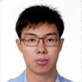

# About Us

We are a team based in the [School of Computing, National University of Singapore](http://www.comp.nus.edu.sg).

## Project Team

#### [Varun Gupta](http://github.com/varung97)  
  
**Role**:  
**Responsibilities**:

-----

#### [Gary Tang](https://github.com/e0003506)
  
**Role**:  
**Responsibilities**:

-----

#### [Zhao Dingfan](https://github.com/e0003506)
  
**Role**:  
**Responsibilities**:

-----
#### [Leow Yijin](http://github.com/yijinl)
  
**Role**:  
**Responsibilities**:

-----

#### [Martin Choo](http://github.com/m133225)
  
**Role**:  
**Responsibilities**:

-----

# Contributors

We welcome contributions. See [Contact Us](ContactUs.md) page for more info.
